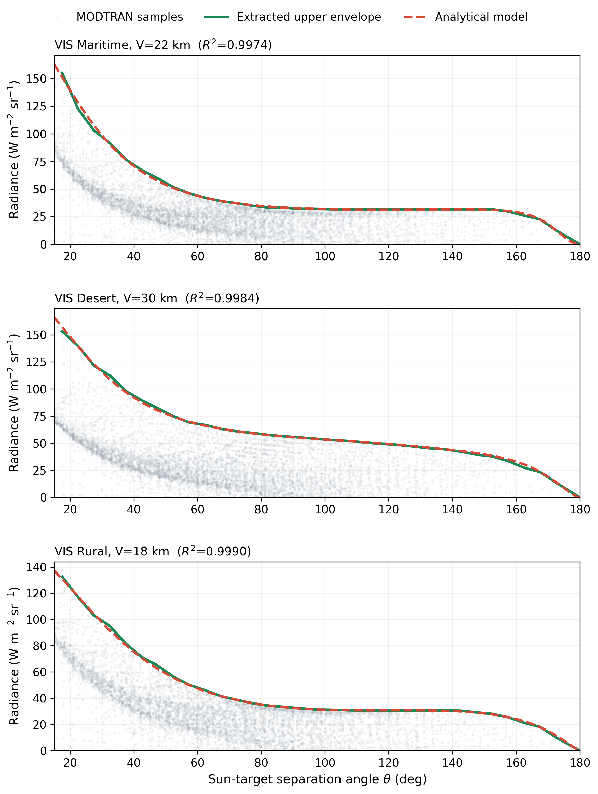
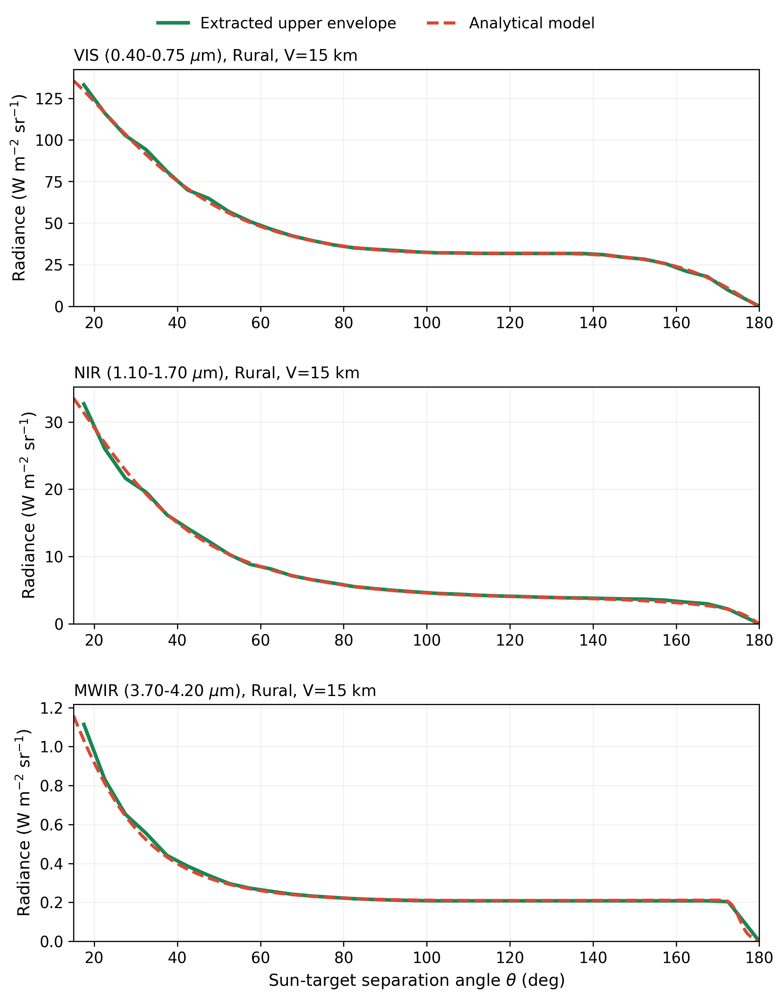

# Atmospheric Radiance Safe Angle

A compact, physics-informed atmospheric-optics model for converting
full-geometry sky-background calculations into an engineering upper-bound
curve and rapidly estimating the minimum admissible Sun-target separation for
ground-based daytime observation.

The package evaluates a frozen model over VIS, NIR, and MWIR bands; maritime,
desert, and rural atmospheric scenes; visibility from 2 to 30 km; and
Sun-target separations from 15 degrees to less than 180 degrees. It then
compares the atmospheric curve with a radiance limit supplied by the
observation system.

> **Meaning of "safe":** a safe angle here means only that the modeled
> atmospheric background radiance remains below a user-supplied radiance
> threshold at that angle and every larger sampled angle. It is not an
> eye-safety, laser-safety, hardware-survival, or certified operational-safety
> guarantee.

## Model

The base output is the band-integrated atmospheric background-radiance
engineering upper bound

$$
L_{\mathrm{env}}(\theta,V,b,s)
=\left[W_{b,s}(V)P_{\mathrm{HG}}(\theta;g_{b,s})+D_{b,s}(V)\right]
T_{\mathrm{base},b,s}(\theta,V)
+S_{b,s}(V)x^{a_{b,s}}T_{\mathrm{shoulder},b,s}(\theta,V),
$$

where $x=(1-\cos\theta)/2$. A separately calibrated residual factor forms

$$
L_{\mathrm{safe}}(\theta,V,b,s)=K_qL_{\mathrm{env}}(\theta,V,b,s),
\qquad K_q\ge1.
$$

Given an instrument-specific admissible background radiance
$L_{\mathrm{lim}}$, the query returns the first grid angle after which all
larger sampled separations satisfy
$L_{\mathrm{safe}}\le L_{\mathrm{lim}}$. The shared expression is unchanged
across bands and scenes; only one of the nine frozen parameter rows is
selected. See [the complete model definition](docs/model.md).

## Quick start

Requires Python 3.10 or newer.

~~~bash
git clone https://github.com/LuHao55kai/atmospheric-radiance-safe-angle.git
cd atmospheric-radiance-safe-angle
python -m pip install -e .
python examples/quickstart.py
~~~

Direct API use:

~~~python
import numpy as np

from atmospheric_safe_angle import (
    environment_radiance_upper_bound,
    minimum_safe_angle,
)

theta = np.arange(15.0, 180.0, 0.1)
curve = environment_radiance_upper_bound(
    theta,
    visibility_km=15.0,
    band="vis",
    scene="rural",
)

# Illustrative only: replace with a calibrated system limit.
radiance_limit = float(np.median(curve))
theta_min = minimum_safe_angle(
    radiance_limit,
    visibility_km=15.0,
    band="vis",
    scene="rural",
    safety_factor=1.0,
)
print(theta_min)  # 97.5 degrees
~~~

The public API accepts <code>desert</code>, <code>maritime</code>, and
<code>rural</code>. The legacy label <code>ocean</code> remains an alias for
<code>maritime</code>.

## Evidence at a glance

| Evidence | Scope | Frozen result |
|:---|:---|---:|
| Full-geometry MODTRAN audit | 117 complete cases; 2,007,837 radiance records | Mean $R^2$: VIS 0.9958, NIR 0.9970, MWIR 0.9892 |
| VIS leave-one-scenario-out test | 39 withheld-case fits | Mean $R^2=0.9945$ |
| VIS large-angle ablation | 39 complete VIS cases | 120-180 degree and 150-180 degree NRMSE reduced by 86.5% and 87.1% |
| DSL-1 field VIS evaluation | 17,458 strictly screened samples from two days at one site | Base-curve pointwise coverage 99.43% |
| AERONET angular-trend diagnostic | 9,907 scans; 161,367 narrowband-proxy samples | Base-curve engineering coverage 87.91% |
| Formula plus suffix-safe search | 1,650 angular nodes on the reported Apple M1 setup | Median 0.136 ms per query |

These rows represent different evidence levels. NIR and MWIR results are
complete-grid simulation adaptation tests, not field validation. The AERONET
result uses a two-channel VIS engineering proxy and site-scale processing, so
it is angular-trend evidence rather than an independent broadband absolute-
radiance blind test. The DSL-1 result uses an external meteorological
visibility proxy and is limited to one rural/farmland site, one instrument,
and two winter days. Full details are in [validation scope](docs/validation.md).

## Validated domain

| Input | Supported domain |
|:---|:---|
| Sun-target separation $\theta$ | $15^\circ\le\theta<180^\circ$ |
| Meteorological visibility $V$ | 2-30 km |
| Band $b$ | VIS 0.40-0.75 um; NIR 1.10-1.70 um; MWIR 3.70-4.20 um |
| Scene $s$ | Maritime, desert, rural |
| Output | Band-integrated radiance in $\mathrm{W\,m^{-2}\,sr^{-1}}$ |

The implementation rejects inputs outside this domain rather than silently
extrapolating. The exact 180 degree point used during fitting was an artificial
zero-valued endpoint regularizer, not a physical observation, and is excluded
from the callable domain.

## Repository contents

| Path | Contents |
|:---|:---|
| <code>src/atmospheric_safe_angle/</code> | Frozen formula, safe-angle search, and nine full-precision parameter rows |
| <code>tests/</code> | Numerical golden tests, aliases, domain checks, and search-boundary tests |
| <code>examples/quickstart.py</code> | End-to-end evaluation and angle query |
| <code>results/</code> | Frozen band-, scene-, and case-level aggregate metrics |
| <code>figures/</code> | Selected manuscript-supporting figures |
| <code>docs/</code> | Equations, validation interpretation, and data-availability boundaries |

This release reproduces the frozen formula evaluation and the safe-angle
query. It does not regenerate MODTRAN calculations or refit coefficients from
scratch because the licensed solver, original run configuration, and complete
raw reference grid are not redistributed here.

## Data availability

The repository includes fitted parameters, scenario-level simulation metrics,
aggregate public-scan diagnostics, aggregate field statistics, figures, and
the executable model. It intentionally excludes:

- MODTRAN software and other licensed solver assets;
- the 2,007,837-row raw simulation grid;
- raw DSL-1 spectra, instrument-owned files, and local file paths;
- raw AERONET downloads, which should be obtained from the official service;
- patent documents, author comments, manuscript working files, and excluded
  diagnostic datasets.

See [data availability and provenance](docs/data_availability.md).

## Citation and license

Until the manuscript-linked Zenodo archive is created, cite this repository
using its URL and the release tag or commit hash. Formal author metadata must
be supplied before a <code>CITATION.cff</code> file and DOI record are added;
none is inferred here.

Python code is MIT licensed. Parameters, aggregate results, project figures,
and documentation are CC BY 4.0 licensed. Third-party source data are not
relicensed; see [DATA_LICENSE.md](DATA_LICENSE.md).
